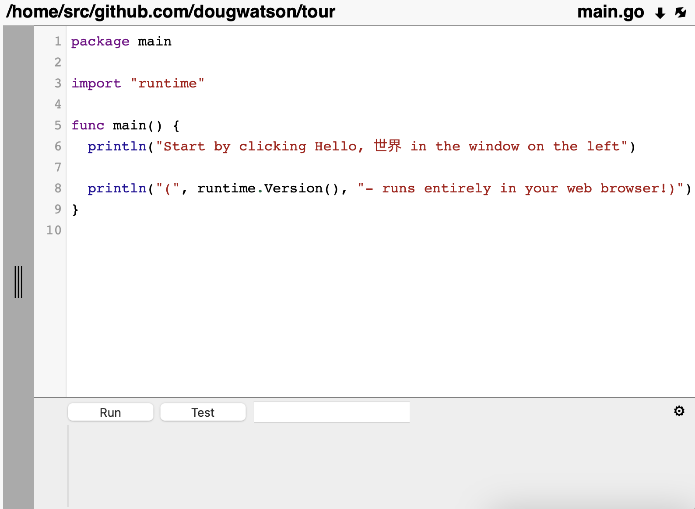

<h1>Hello, from web assembly</h1>

&nbsp;&nbsp;&nbsp;&nbsp;Run the complete <b>'Tour of Go'</b> in your web browser. Try turning off your internet and see that it still works!
  

  <a href="https://go.dev/tour/welcome/1">Based on the original 'Tour of Go', by the Go Authors</a>

  
